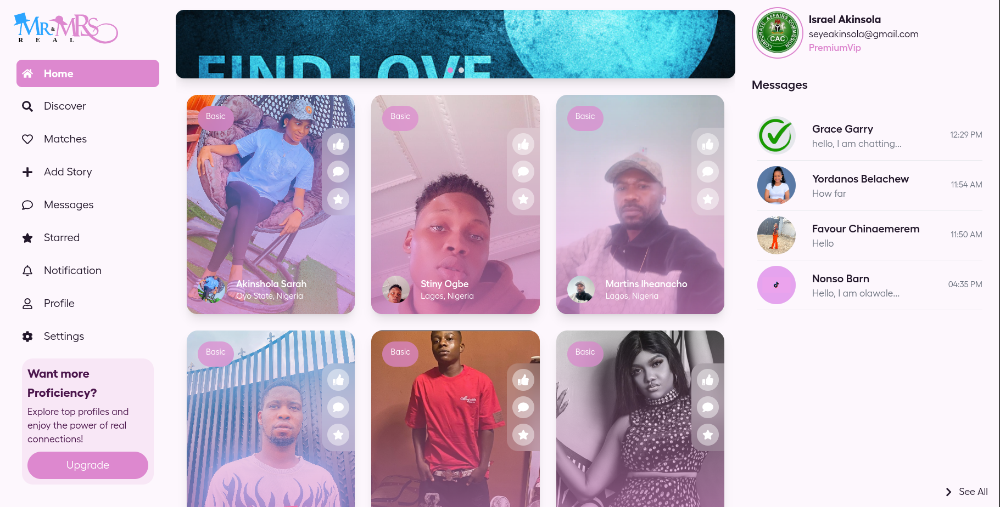
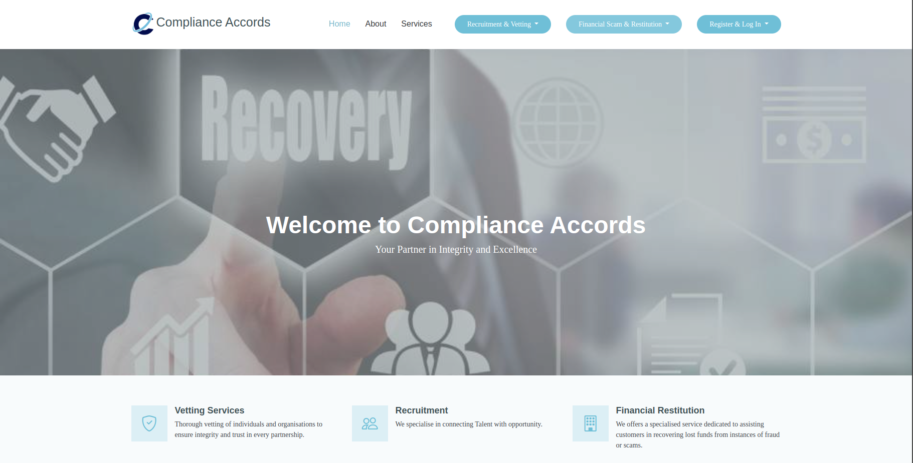
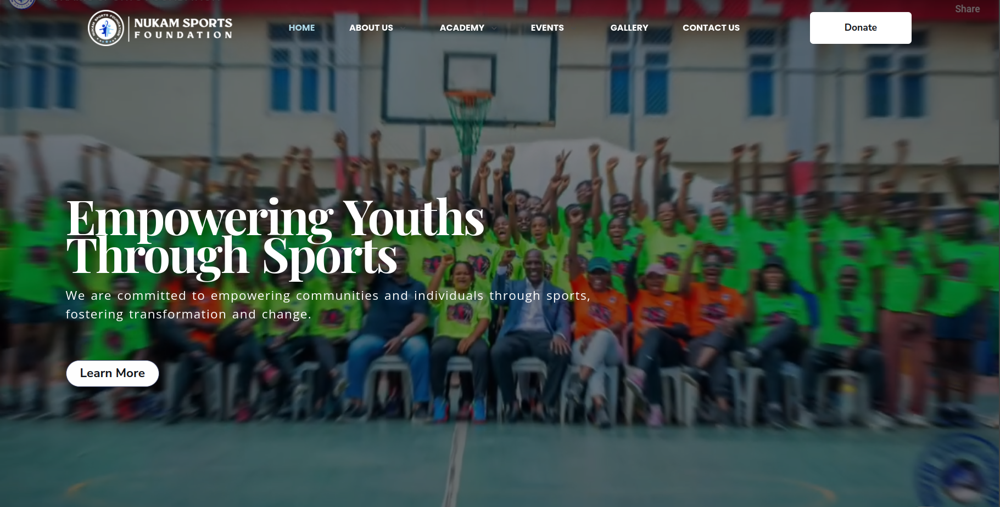
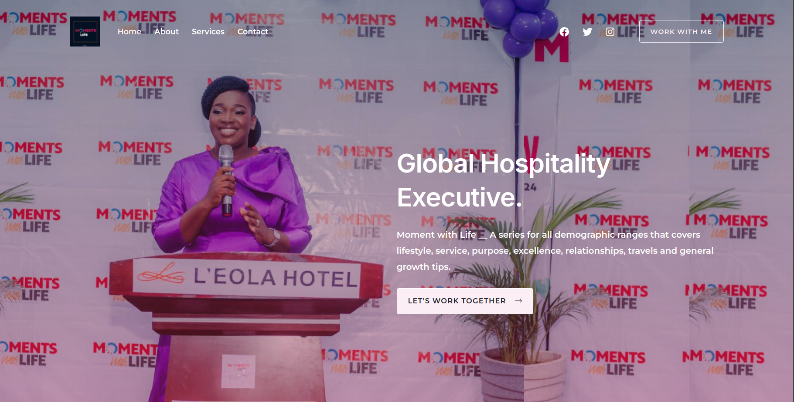

# 👋 Hi, I'm Israel Akinsola!

🚀 **Full Stack Developer | Laravel | Vue.js | React | Node.js | Backend Heavy**  

I specialize in building secure, scalable, and high-performance web applications. With expertise in backend development and full-stack integrations, I create seamless digital experiences.

---

## 📌 Featured Projects  

### 1️⃣ [MrAndMrsReal.com - Dating App](https://mrandmrsreal.com)  
  

**🔹 Role:** Backend Contribution  
**🔹 Description:**  
- Developed the backend architecture for a single-page dating application.  
- Ensured secure authentication, user profile management, real-time matching algorithms, and messaging functionalities.  

### 2️⃣ [ComplianceAccords.com](https://complianceaccords.com)  
  

**🔹 Role:** Full Stack Application Contribution  
**🔹 Description:**  
- Designed and implemented a compliance-focused platform ensuring financial fraud prevention and ethical restitution.  
- Managed frontend and backend integrations for a seamless user experience.  

### 3️⃣ [NukamSports.com](https://nukamsports.com)  
  

**🔹 Role:** Laravel & WordPress Developer  
**🔹 Description:**  
- Built and maintained a sports-centric website using WordPress.  
- Optimized performance and ensured smooth content delivery.  

### 4️⃣ [CashKabash.ng](https://cashkabash.ng)  
  

**🔹 Role:** Full Stack Developer (Laravel & Vue.js)  
**🔹 Description:**  
- Developed a financial transaction platform using Laravel for the backend and Vue.js for the frontend.  
- Ensured a secure and interactive user experience.  

### 5️⃣ [SureDataConsulting.com](https://suredataconsulting.com)  
  

**🔹 Role:** WordPress Developer  
**🔹 Description:**  
- Designed and developed a business consulting website.  
- Ensured an intuitive layout and efficient content management using WordPress.  

### 6️⃣ [LifeOyeWunmi.com](https://lifeoyewunmi.com)  
  

**🔹 Role:** WordPress Developer  
**🔹 Description:**  
- Developed a personal brand website using WordPress.  
- Optimized the site for responsiveness and SEO.  

---

## 🛠️ Tech Stack & Skills  

- **Frontend:** Vue.js, React, JavaScript, TailwindCSS  
- **Backend:** Laravel, Node.js, PHP, MySQL  
- **Other Tools:** WordPress, Git, REST APIs, Authentication  

## 📫 Connect with Me  

- 🌐 [LinkedIn](https://www.linkedin.com/in/israel-akinsola-201954165/)  

⭐ **If you like my work, consider giving a star to my projects!**  
